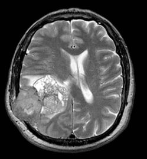

# 🧠 Brain Tumor Detection with Deep Learning (PyTorch)

Este proyecto desarrolla un modelo de **deep learning** utilizando **PyTorch** para la detección de tumores cerebrales en imágenes de resonancia magnética (MRI). El modelo clasifica las imágenes en dos categorías: **tumor** y **sin tumor**, usando un conjunto de datos proporcionado por Kaggle. La estructura del proyecto abarca desde la descarga del dataset hasta la predicción final.

 

## 📑 Tabla de Contenidos
- [Descripción del Proyecto](#-descripción-del-proyecto)
- [Dataset](#-dataset)
- [Estructura del Proyecto](#-estructura-del-proyecto)
- [Uso](#-uso)

## 📝 Descripción del Proyecto

Este proyecto de **Computer Vision** emplea una red neuronal convolucional (CNN) construida con PyTorch para la **detección automática de tumores cerebrales** en imágenes MRI. El modelo se entrena y evalúa utilizando imágenes clasificadas entre "tumor" y "sin tumor".

## 📚 Dataset

El dataset utilizado se descarga desde Kaggle: [Brain MRI Images for Brain Tumor Detection](https://www.kaggle.com/datasets/navoneel/brain-mri-images-for-brain-tumor-detection).

Este conjunto de datos contiene imágenes de resonancias magnéticas (MRI) de cerebros con tumores y sin ellos. Las imágenes se dividen en conjuntos de **entrenamiento** y **prueba** para entrenar y evaluar el modelo.

## 🏗️ Estructura del Proyecto

El proyecto está dividido en los siguientes scripts de Python, cada uno con una funcionalidad específica:

- **`setup.py`**: Descarga el dataset desde Kaggle, organiza los datos y los divide en conjuntos de entrenamiento y prueba.
- **`data_setup.py`**: Crea los `DataLoaders` de PyTorch para gestionar y cargar los datos de imágenes en lotes.
- **`model_builder.py`**: Define la arquitectura de la red neuronal convolucional (CNN) usando PyTorch.
- **`engine.py`**: Contiene el código para entrenar el modelo, manejar las iteraciones y ajustar los parámetros del modelo.
- **`train.py`**: Configura los hiperparámetros, entrena el modelo y guarda el modelo entrenado en la carpeta `models`.
- **`predict.py`**: Realiza predicciones sobre imágenes nuevas utilizando el modelo entrenado.

## ⚙️ Uso

### 1. Entrenamiento del Modelo

Para entrenar el modelo en el conjunto de datos de entrenamiento, ejecuta el siguiente comando:

```bash
python train.py
```

Esto iniciará el proceso de entrenamiento, configurará los hiperparámetros y guardará el modelo entrenado en la carpeta models.

### 2. Realizar una Predicción
Una vez entrenado el modelo, puedes hacer una predicción sobre cualquier imagen específica ejecutando:

```bash
python predict.py --image data/test/imagen_ejemplo.jpg
```
Reemplaza imagen_ejemplo.jpg con la ruta de la imagen sobre la que desees realizar la predicción.
